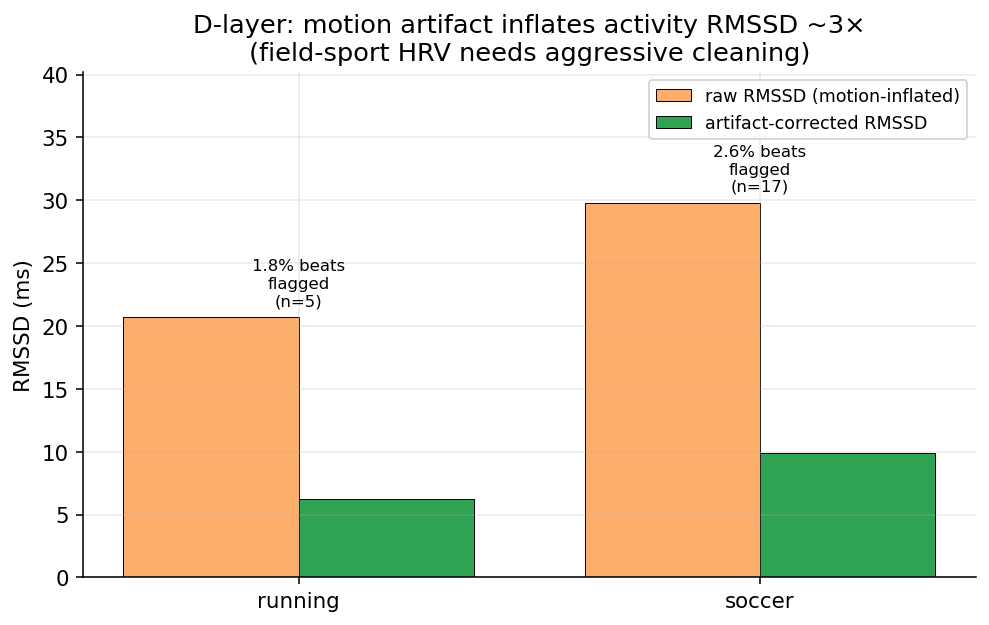
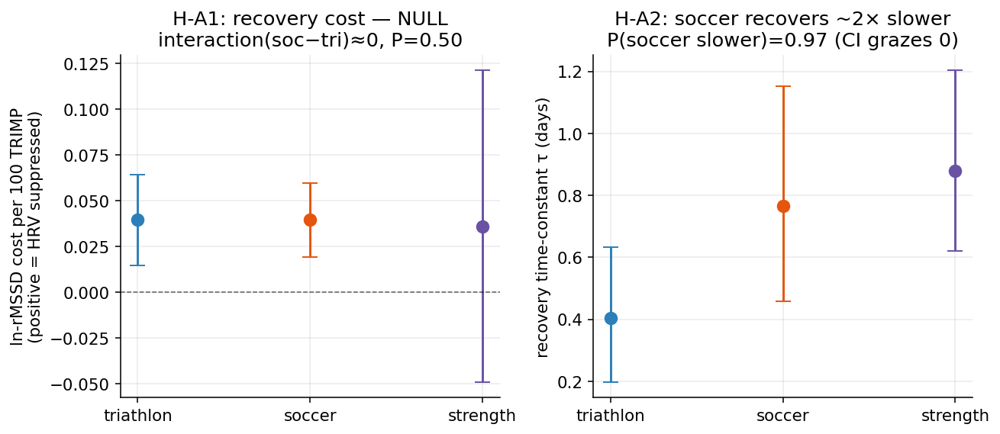
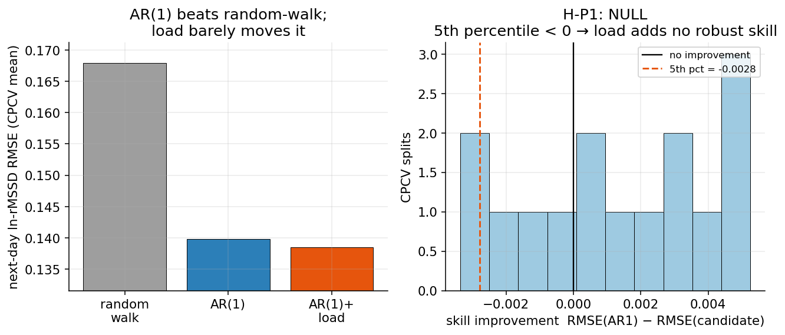
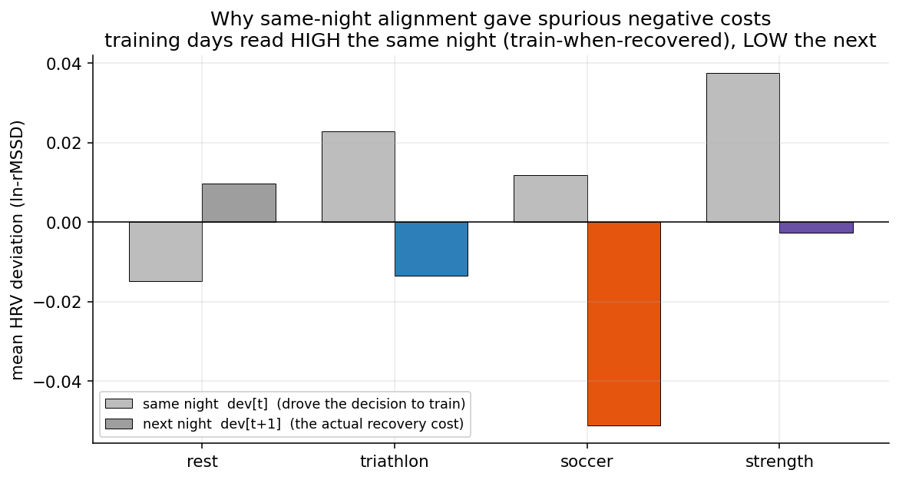

# Garmin dual-sport N-of-1

[](https://github.com/EwanWu06/garmin-nof1/actions/workflows/tests.yml)
· MIT licensed · 134 tests on synthetic ground truth (no private data needed)

A single-subject (N-of-1) study of **cross-sport recovery** built from ~2.5 years of one
athlete's Garmin (Forerunner 955) data spanning two physiologically opposite sports —
**endurance triathlon** and **intermittent-sprint soccer** — with **strength training** as a
third modeled load.

**What this demonstrates (methods):** leakage-safe time-series cross-validation (purged
walk-forward + CPCV, with a leakage-injection test) · within-person Bayesian inference
(closed-form posteriors, ROPE, credible intervals) · pre-registration with an append-only
amendment log · an adversarial multi-agent self-audit that found and fixed a real bug ·
a reproducible, tested toolchain (134 tests, runs with no private data).

The point of this project is *not* "I discovered X." It is: **use quantitative methods to
honestly characterize one complex individual system, and state clearly where the conclusions
stop.** Rigor, honest boundaries, a pre-registered analysis with an append-only amendment log,
and a validated, reproducible toolchain are the deliverables. Two of the three headline tests
land on a **null** — and that is reported as the finding, not hidden.

> **Start here:** `python examples/demo_cv_leakage.py` — a 30-second runnable proof that the
> leakage-safe CV blocks the optimism ordinary k-fold injects. Plain-language overview (中文):
> [docs/项目简介.md](docs/项目简介.md).

> **TL;DR.** On this one athlete: soccer and triathlon tax next-day recovery *equally per unit
> of training load* (**null**), but soccer takes **~2× longer to recover from** (strong, not
> decisive at the 95% bar); and knowing today's training adds **no** useful prediction of
> tomorrow's recovery (**null**, as pre-registered). A measurement layer audits the signal
> quality behind those claims (motion artifact inflates raw activity RMSSD ~3×). **Two of three
> headline tests are nulls — reported, not hidden** — and the numbers survived an adversarial
> multi-agent self-audit that found and fixed a real bug (prereg A7–A10).

## The three layers

| Layer | Question | Pre-registered prior | Real-data outcome |
|---|---|---|---|
| **D — Measurement** | Is the RR→HRV reconstruction correct, and how clean is the strap signal? | Should validate | **Verified + audited** — RR parse self-consistent with the firmware; quantified artifact inflation of RMSSD |
| **A — Headline (H-A1)** | Does **soccer cost more next-day vagal HRV per unit load** than triathlon? | Expected positive | **Null** — per-TRIMP cost is the same across sports |
| **A — Headline (H-A2)** | Is the **recovery time-constant τ** sport-specific? | Expected positive | **Soccer ~2× slower** to recover than triathlon; strong (P≈0.97) but just shy of the 95% bar |
| **Prediction (demoted, H-P1)** | Does cross-sport load add next-day-HRV skill **over AR(1) / random-walk**? | Expected null | **Null** — AR(1) beats random-walk, load adds nothing robust |

## Results

### D — Measurement: RR reconstruction self-consistency + RR quality audit (chest-strap window, 22 RR-bearing sessions)
- **RR parsing is self-consistent.** Our `60000/mean(RR)` vs Garmin's firmware `avg_heart_rate`
  agree to ~1 bpm (bias −1.2, ICC 0.99, MAPE 0.93%) — but both come from the *same* chest-strap
  beat stream, so this is a parse/concatenation **self-consistency check** (it catches gross
  parser bugs), **not** independent device agreement. We don't claim it as a sensor validation.
- **Quality audit (the substantive D-layer result).** Artifact correction removes **~19 ms** of
  motion-inflated RMSSD (raw ~3× the corrected value); soccer
  (2.6% artifact beats, n=17) is noisier than running (1.8%, n=5) — field sport HRV needs
  aggressive cleaning, which is *why* the study uses Garmin's clean overnight HRV for the panel.
- **Honest scope.** When a chest strap is paired the watch logs it as the *sole* HR source,
  so the FITs carry **no independent wrist-optical series** — a simultaneous wrist-vs-chest
  *device* comparison is not supported and is **not claimed** (demoted; see prereg A5).


*Raw activity RMSSD runs ~3× the artifact-corrected value; field sport (soccer) is noisier than steady-state (running). The substantive D-layer finding — why the daily panel uses clean overnight HRV.*

### A — Differential recovery (904-day panel; triathlon 114 / soccer 48 / strength 90)
- **H-A1 (cost): null.** Next-night ln-RMSSD cost per 100 TRIMP is ~0.04 for all three sports —
  triathlon and soccer essentially identical — so the soccer−triathlon interaction is ≈0
  (posterior P(interaction>0)≈0.50, a coin-flip → no directional effect). Per unit of *HR-based*
  load, the sports tax vagal recovery equally. (Caveat: TRIMP underestimates soccer's
  intermittent sprint load, so "equal per TRIMP" ≠ "equal per session.")
- **H-A2 (recovery speed): suggestive.** Recovery time-constant τ: **triathlon 0.40 d,
  soccer 0.77 d, strength 0.88 d**. Soccer recovers ~2× slower than triathlon
  (posterior P(soccer slower)≈0.97), but the 95% credible interval grazes 0 — **not decisive**
  at the pre-registered threshold; soccer's 48 sessions are the power bottleneck.
- **Strength matters.** Modeling strength as its own load (not folding it into "rest") both
  keeps the headline contrast clean and shows strength carries the longest recovery cost — a
  signal that would vanish if it were lumped into the baseline.
- **Negative control passes.** The pre-registered negative control (OSF §4) — sleep duration as
  the outcome — shows **no** sport×TRIMP interaction (95% CrI (−0.35, +0.16) straddles 0),
  i.e. a generic "hard day" effect is not masquerading as a sport-specific recovery cost.


*H-A1: per-100-TRIMP cost is the same across sports (posterior P(interaction>0)≈0.50, null). H-A2: recovery τ is ~2× longer for soccer (posterior P(soccer slower)≈0.97), 95% credible interval grazes 0. Bars = 95% credible intervals.*

### P — Prediction (demoted falsification)
- Predicting next-day ln-RMSSD: random-walk RMSE 0.168, **AR(1) 0.140** (persistence is
  real), candidate AR(1)+load **0.139**. CPCV skill-improvement 5th percentile < 0 →
  **H-P1 does not beat baseline** (null, matching the prior). Effective sample size ≈ **324**
  independent days out of 723 (computed on the detrended residual) — the ceiling on power,
  reported alongside the result.


*AR(1) clearly beats random-walk; adding cross-sport load barely moves RMSE. The CPCV skill-improvement distribution straddles 0 (5th percentile < 0) → H-P1 null.*

## A methodological highlight: HRV timestamp alignment

The first real-data fit produced *negative* recovery costs (training appeared to *raise*
next-day HRV). The cause was not physiology but **timing**: Garmin stamps an overnight HRV
reading to the *morning*, so a day's training first affects the *next* night — while the naïve
model aligned load with the *same* night, the night whose good reading actually *drove the
decision to train* ("train-when-recovered" reverse causation). Aligning load to the night it
affects (`load_lag=1`) flips the costs to the physiological sign and matches the pre-registered
`Δlndev[t+1] ~ TRIMP[t]` formula. This is the kind of confound that only shows up on real data,
and it is logged transparently in the pre-registration (amendment A1).


*Training days read HIGH the same night (you train when you wake up recovered — reverse causation) but LOW the next night (the real recovery cost). Aligning load to the next night fixes it.*

## Honest constraints (these shape everything)

- **Nightly HRV is a Garmin-derived RMSSD summary**, not raw beats — a *within-subject*
  trend/target, never ground truth (cf. Garmin's mid-tier concordance in the wearable-HRV
  literature).
- **True beat-to-beat RR exists only for the chest-strap window** (HRM-Pro + "Log HRV" during
  activities). Wrist optical does not write usable RR, so RR-level work (the D-layer) is scoped
  to that window — 22 sessions.
- **Observational, no randomization** → causal language stays at the association /
  sensitivity-analysis level. Sport is entangled with season, so a cross-sport difference is a
  within-person association, not a causal sport effect.
- **N-of-1.** Everything is about *this person*; nothing here generalizes to a population.

## Pre-registration and honesty log

`preregistration/OSF_preregistration.md` holds the analysis plan (hypotheses, decision rules,
ROPE, holdout). Because the data already existed, §13 is an **append-only amendments log** —
every post-draft change and every departure from the plan is recorded with a date and the
commit that made it:

- **A1** load↔HRV alignment correction · **A2** strength as a 3rd modeled sport ·
  **A3** full disclosure that the A-layer was fit exploratorily on the whole panel ·
  **A4** TRIMP HR bounds derived from data · **A5** H-D1 rescoped (no wrist-vs-chest) ·
  **A6** prediction candidate simplified to OLS (ESS too small for Kalman/GBM).
- **A7–A10** (from an adversarial multi-agent correctness audit): **A7** TRIMP double-counting
  fixed (de-dup overlapping archives by `activityId`) · **A8** ESS computed on the detrended
  residual, not the raw trend · **A9** D-layer HR check relabeled as RR-parse self-consistency,
  not independent agreement · **A10** minor correctness/labeling fixes (CPCV `purge=1`,
  lag-aligned session counts, validator bound, ESS docstring, mixed-sport-day limitation).

The prediction layer kept its discipline: developed on the first 80%, the 20% holdout
evaluated exactly **once**.

## Repository layout

```
src/garmin_nof1/
  data/synthetic.py      # daily panel with a KNOWN generative structure (test substrate)
  eval/
    cv.py                # leakage-safe time-series CV: PurgedWalkForward, CPCV, ESS
    agreement.py         # Bland-Altman / ICC(2,1) / MAPE / CCC (D-layer)
  pipeline/
    ingest_garmin.py     # credential-gated Garmin pull; archives raw JSON/FIT (private)
    garth_cn.py          # Garmin China (connect.garmin.cn) OAuth adapter via garth
    garmin_schema.py     # archived Garmin JSON -> tidy records
    parse_rr.py          # activity-FIT hrv messages -> RR (ms) -> RMSSD/SDNN + quality
    trimp.py             # Banister / Edwards / Garmin training-load variants
    build_panel.py       # tidy, missingness-aware daily panel (synthetic-schema compatible)
  models/
    recovery_cost.py     # H-A1: differential next-night recovery cost (Bayesian conjugate)
    recovery_tau.py      # H-A2: per-sport recovery time-constant (Monte-Carlo from posterior)
    prediction.py        # H-P1: AR(1)/random-walk baselines + load candidate, CPCV + holdout
scripts/
  pull_garmin.py         # one command to pull your own data (US via garminconnect, CN via garth)
  check_panel.py         # build + sanity-check the panel (privacy-safe summary)
  dlayer_report.py       # D-layer reconstruction validation + RR quality audit
  prediction_report.py   # H-P1 holdout-safe skill report
  make_figures.py        # regenerate the README figures (privacy-safe aggregates)
examples/
  demo_cv_leakage.py     # runnable proof: leakage optimism + ESS << nominal day count
docs/figures/            # committed README figures (aggregate effect estimates only)
tests/                   # pytest, 134 tests — incl. leakage-injection + estimator recovery
data/                    # gitignored: raw FIT/JSON archive + derived panel (never committed)
preregistration/         # OSF pre-registration + append-only amendment log
```

## Setup

```bash
mamba env create -f environment.yml     # or: conda env create -f environment.yml
conda activate garmin-nof1
pip install -e .
pytest                                  # 134 tests, all on synthetic data — no private data needed
```

Everything that gates a conclusion (the leakage-safe CV, the estimators, the agreement stats)
is validated on a synthetic substrate with known ground truth, so the test suite runs without
any personal data.

## Reproduce on your own Garmin data

Your password is typed interactively and never written to disk; raw data stays under
`data/` (gitignored) and is analyzed locally.

```bash
# 1. Pull (US/global account via garminconnect; China account via garth with --cn)
python scripts/pull_garmin.py --start 2024-01-01 --end 2026-06-15
python scripts/pull_garmin.py --cn --start 2024-01-01 --end 2025-12-15   # China account
python scripts/pull_garmin.py --start 2026-03-01 --end 2026-06-15 --fits # FITs (RR) for D-layer

# 2. Build + sanity-check the combined daily panel
python scripts/check_panel.py

# 3. Run the layers
python scripts/dlayer_report.py        # D: HRV reconstruction validation + RR quality
python scripts/prediction_report.py    # P: H-P1 skill vs baseline (holdout-safe)

# 4. Regenerate the README figures
python scripts/make_figures.py         # -> docs/figures/*.png
```

The A-layer models (`fit_recovery_cost`, `fit_recovery_tau`) take the built panel directly;
HR bounds for TRIMP are derived from your own data (median resting HR; max activity HR) per
prereg A4.

## Status

**Complete.** All three layers are built, validated on synthetic ground truth, and run on the
real combined panel; 134 tests pass. The scientific story is two honest nulls (H-A1, H-P1), one
strong-but-not-decisive effect (H-A2: soccer recovers slower), and a measurement-pipeline
self-consistency check + RR quality audit (D) — with every analytical decision logged in the
pre-registration.

## Author

Ewan Wu — [github.com/EwanWu06](https://github.com/EwanWu06) · wuyouyou2017@gmail.com
A single-subject portfolio project for biostatistics / computational-biology graduate applications.

## Notes on tooling

Built with an AI-assisted workflow (Claude Code — see `CLAUDE.md` and the `Co-authored-by`
commit trailers). I set the goals and constraints, made the key modeling and scope calls
(e.g. modeling strength training as its own load type; running the analysis on my own real
data; commissioning the correctness audit), and required the work to be pre-registered and
reported honestly, nulls included; the assistant proposed methods and wrote the implementation
under that direction. Directing and auditing a capable AI toward a trustworthy,
honestly-reported result is itself a skill this project reflects.
